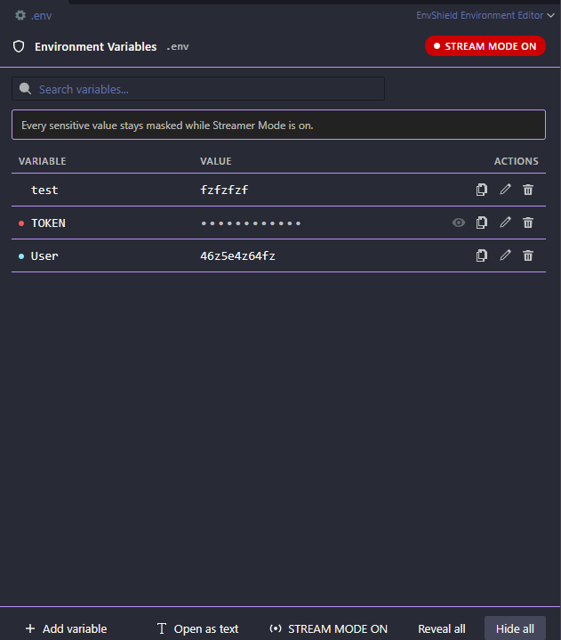

<div align="center">


# EnvShield

**Hide your environment variables while screen sharing, streaming or recording — without ever changing your `.env` files.**

[Features](#features) · [How it works](#how-it-works) · [Security](#security-model) · [Configuration](#configuration) · [Commands](#commands) · [Architecture](#architecture) · [Development](#development)

</div>

---

## The problem

You are live on Twitch. You open `.env` to check a port number. Your Discord bot token is on line 1, in 14px monospace, for 40 seconds, in a VOD that will be clipped.

Blurring the window is not an option — you still need to work in it. Renaming the file breaks your app. Editing the format breaks dotenv.

## The answer

EnvShield adds a **display layer** on top of your environment files. The file on disk stays a byte-for-byte standard `.env`, loadable by Node.js, Python, .NET, Docker Compose and everything else. What changes is what your screen shows.

```text
On disk (unchanged)                    In EnvShield
─────────────────────────────────      ────────────────────────────────────────
DISCORD_TOKEN=eyJhbGciOiJIUzI1...      DISCORD_TOKEN    ••••••••••••    👁
DATABASE_URL=postgres://u:p@db         DATABASE_URL     ••••••••••••    👁
API_KEY=sk-proj-1a2b3c4d5e6f           API_KEY          ••••••••••••    👁
PASSWORD=hunter2                       PASSWORD         ••••••••••••    👁
PORT=3000                              PORT             3000
NODE_ENV=development                   NODE_ENV         development
```

Click the eye to reveal one value. It re-masks itself after a few seconds. Hit `Ctrl+Shift+Alt+E` and nothing can be revealed at all.

---

## Screenshots



_Streamer Mode: every sensitive value stays masked, and reveal is refused on the
extension host rather than merely hidden in the interface._

---

## Features

- **Secure editor for `.env` files** — a table view where sensitive values are masked before the first frame is painted.
- **Scored secret detection** — a committee of detectors (name heuristics, ~22 known credential formats, entropy analysis, your own regexes) produces a 0-100 score, not a yes/no guess. `PORT=3000` stays visible; `DISCORD_TOKEN` does not.
- **Temporary reveal** — one click, one value, automatically re-masked after a configurable timeout.
- **Streamer Mode** — one shortcut, and no value can be revealed until you turn it off. Even values already on screen are hidden immediately.
- **Panic button** — `Ctrl+Shift+Alt+H` cancels every timer and re-masks every surface.
- **Workspace scan** — finds credentials hardcoded in `.json`, `.yaml`, `.yml` and `.toml`, reported as normal VS Code diagnostics.
- **Explorer section** — every environment file of the workspace, with its variables, masked.
- **Never a lock-in** — "Open as Plain Text" is always one click away, and the text editor stays the default until you decide otherwise.
- **Fully local** — no network call, no telemetry, no analytics, no external API.

---

## Installation

From the Marketplace:

```
ext install envshield.envshield
```

Or search for **EnvShield** in the Extensions view.

From a `.vsix`:

```bash
npm install
npm run package
code --install-extension envshield-1.0.0.vsix
```

Publishing your own build? See [PUBLISHING.md](PUBLISHING.md) — three manifest
fields have to be replaced first.

---

## How it works

### Opening a file

Right-click any `.env` file → **Open Environment File**, or run `EnvShield: Open Environment File` from the palette.

EnvShield is contributed with `priority: "option"`, so it never hijacks your files. To make it the default:

```
EnvShield: Use EnvShield as Default Editor for .env Files
```

This writes `workbench.editorAssociations` — a standard VS Code setting you can inspect and revert, either by hand or with `EnvShield: Stop Using EnvShield as Default Editor`.

### Reveal and hide

| Action                         | Where                                                               |
| ------------------------------ | ------------------------------------------------------------------- |
| Reveal one value               | Eye button in the editor or the Explorer view                       |
| Hide one value                 | Same button, which becomes a crossed-out eye                        |
| Hide everything now            | `Ctrl+Shift+Alt+H`, the **Hide all** button, or `Esc` in the editor |
| Reveal everything in this file | **Reveal all** button                                               |

A revealed value re-masks itself after `envshield.revealTimeout` milliseconds (default 5000; `0` disables the timeout).

Reveals are also dropped when:

- the editor tab loses visibility,
- the VS Code window loses focus,
- Streamer Mode is turned on,
- the window is reloaded.

### Streamer Mode

```
EnvShield: Toggle Streamer Mode          Ctrl+Shift+Alt+E   (Cmd on macOS)
```

While it is on:

- the status bar shows **Stream Safe** on a warning background,
- the editor header shows a **STREAM MODE ON** badge,
- every reveal button is disabled,
- and, more importantly, the extension host **refuses** to send a plaintext value to the webview. The UI state is a consequence of the refusal, not the mechanism.

The state is persisted in `envshield.streamerMode`, so it survives a reload — you cannot forget to re-enable it after restarting VS Code mid-stream.

### Workspace scan

```
EnvShield: Scan Workspace
```

Reports findings as diagnostics in the Problems panel. Messages contain the variable name, the severity and the reason — **never the value**.

Choosing **Ignore these** stores a salted SHA-256 fingerprint of `path + variable name` in VS Code's `SecretStorage`, so the finding is not raised again. The value itself is never stored.

---

## Security model

### What EnvShield guarantees

**Your environment variables never leave your machine.** No network call of any kind. No telemetry. No analytics. No crash reporting. Detection is entirely local, entirely regex and arithmetic.

**The file is the only source of truth.** EnvShield never copies a value into `settings.json`, `globalState`, `SecretStorage`, or any cache that outlives the session.

**Plaintext crosses the process boundary once per reveal.** The webview receives a payload where every secret is already replaced by mask characters. A real value is delivered only by a dedicated single-variable message, in response to an explicit reveal. This is why the search box filters variable _names_ only: the values are simply not in the webview to search.

**No first-frame leak.** The editor's initial HTML is generated on the extension host with values already masked. There is no moment — not one frame — where the raw file is rendered and then hidden. This is the reason EnvShield uses a custom editor rather than editor decorations, which can only mask text _after_ it has been laid out.

**Nothing sensitive is ever logged.** All output goes through `safeLog`, which runs every message and every argument through a redactor. There is no raw or debug mode that bypasses it. See `src/utils/redact.ts`, and the tests in `test/unit/LeakPrevention.test.ts` that assert it.

**The webview is locked down.** Strict CSP (`default-src 'none'`), nonce-gated scripts, `localResourceRoots` restricted to `media/`, no remote content, no storage.

### What EnvShield cannot do

This is the part most tools leave out.

VS Code's extension API offers no way to alter what the following render. EnvShield does **not** protect:

| Surface                                   | Why                                           |
| ----------------------------------------- | --------------------------------------------- |
| The integrated terminal                   | No API to read or rewrite the terminal buffer |
| The debug console                         | Same                                          |
| Output channels owned by other extensions | Same                                          |
| `console.log` in your own application     | It is your process, not ours                  |
| Other extensions' webviews and tree views | Extension isolation                           |
| Git diffs and SCM views                   | Rendered by VS Code and the Git extension     |
| Anything outside VS Code                  | Browser, terminal emulator, password manager… |

> **EnvShield protects the display of supported files inside VS Code. It cannot guarantee that a secret deliberately printed in an external terminal or a third-party application will be masked.**

The `ProtectionProvider` interface in `src/streamer/ScreenProtection.ts` exists so that any surface VS Code _does_ expose in the future can be added without redesigning anything. We will not ship a protection we cannot actually enforce.

### Detection is a heuristic

The scoring model is tuned to be cautious, but it is a heuristic. A value it scores 40 might still be a credential. Use `envshield.alwaysMask` for anything you want guaranteed masked, whatever the score says.

---

## Detection and scoring

Each variable receives a score from 0 to 100:

| Score  | Severity   | Behaviour                       |
| ------ | ---------- | ------------------------------- |
| 0-30   | Normal     | Shown in clear                  |
| 31-60  | Suspicious | Shown, flagged in the tree view |
| 61-80  | Sensitive  | **Masked**                      |
| 81-100 | Secret     | **Masked**                      |

The threshold is `envshield.maskThreshold` (default 61).

Signals combined:

1. **Name heuristics** — the key is tokenized (`nextPublicApiKey` → `NEXT`, `PUBLIC`, `API`, `KEY`) and matched against credential keywords. Names marked public (`PUBLIC`, `PUBLISHABLE`, `EXAMPLE`…) lose 45 points.
2. **Known formats** — GitHub, GitLab, AWS, JWT, Stripe, OpenAI, Anthropic, Discord, Slack, Google, SendGrid, npm, Twilio, Square, OAuth secrets, PEM blocks, URLs carrying credentials, bearer tokens.
3. **Entropy** — Shannon entropy, character-class diversity and repetition ratio, with guards so that URLs, paths, prose, booleans and numbers are not flagged.
4. **Your own rules** — `envshield.secretPatterns`.

Two independent signals agreeing add a 10-point bonus.

Adding a detector is a matter of implementing one interface:

```ts
export interface SecretDetectorContract {
  readonly name: string;
  detect(input: DetectionInput): DetectionResult | null;
}
```

---

## Configuration

| Setting                        | Default                   | Description                                                   |
| ------------------------------ | ------------------------- | ------------------------------------------------------------- |
| `envshield.enabled`            | `true`                    | Master switch                                                 |
| `envshield.streamerMode`       | `false`                   | Streamer Mode state, persisted                                |
| `envshield.revealTimeout`      | `5000`                    | ms before re-masking. `0` = never                             |
| `envshield.maskCharacter`      | `"•"`                     | Character used for masks                                      |
| `envshield.maskPreserveLength` | `false`                   | Mask with the real length. Off, because length is information |
| `envshield.autoDetectSecrets`  | `true`                    | Use the scoring model                                         |
| `envshield.detectConfigFiles`  | `true`                    | Also scan JSON / YAML / TOML                                  |
| `envshield.protectEnvExample`  | `false`                   | Treat `.env.example` as holding real secrets                  |
| `envshield.filePatterns`       | `[".env*", "*.env"]`      | Which files EnvShield handles                                 |
| `envshield.secretPatterns`     | `[]`                      | Your own detectors                                            |
| `envshield.ignoredVariables`   | `[]`                      | Excluded from detection entirely                              |
| `envshield.alwaysMask`         | `[]`                      | Always masked, whatever the score                             |
| `envshield.neverMask`          | `["PORT", "NODE_ENV", …]` | Never masked                                                  |
| `envshield.maskThreshold`      | `61`                      | Minimum score to mask                                         |
| `envshield.showStatusBar`      | `true`                    | Show the status bar item                                      |
| `envshield.scanOnStartup`      | `false`                   | Scan when the extension activates                             |
| `envshield.configFileGlobs`    | `["**/*.json", …]`        | Files included in the scan                                    |

`alwaysMask`, `neverMask` and `ignoredVariables` accept glob patterns:

```jsonc
{
  "envshield.alwaysMask": ["*_TOKEN", "*_SECRET", "*_PASSWORD", "DISCORD_*"],
  "envshield.neverMask": ["PORT", "NODE_ENV", "DEBUG", "LOG_LEVEL"],
  "envshield.secretPatterns": [
    { "name": "Internal service key", "pattern": "^svc_[a-f0-9]{32}$", "score": 100 },
  ],
}
```

`alwaysMask` always wins over `neverMask`.

---

## Commands

| Command                                                     | Default shortcut   |
| ----------------------------------------------------------- | ------------------ |
| `EnvShield: Open Environment File`                          |                    |
| `EnvShield: Open as Plain Text`                             |                    |
| `EnvShield: Hide All Secrets`                               | `Ctrl+Shift+Alt+H` |
| `EnvShield: Reveal All Secrets`                             |                    |
| `EnvShield: Toggle Streamer Mode`                           | `Ctrl+Shift+Alt+E` |
| `EnvShield: Scan Workspace`                                 |                    |
| `EnvShield: Configure`                                      |                    |
| `EnvShield: Use EnvShield as Default Editor for .env Files` |                    |
| `EnvShield: Stop Using EnvShield as Default Editor`         |                    |
| `EnvShield: Show Welcome Page`                              |                    |

Both shortcuts are ordinary VS Code keybindings: rebind them in **Preferences → Keyboard Shortcuts**, nothing is hardcoded.

---

## Accessibility

- Every control is reachable by keyboard; `Esc` in the editor hides everything.
- Every icon button carries an explicit label (`Reveal DISCORD_TOKEN`, `Hide DISCORD_TOKEN`).
- The table uses real `<table>` semantics with scoped headers.
- Every colour comes from a `--vscode-*` variable, so Dark+, Light+ and High Contrast all work, and no colour is imposed.
- Status changes are announced via `role="status"`.
- `prefers-reduced-motion` is honoured.

---

## Internationalization

English is the default. French ships with the extension. Translations live in:

- `package.nls.json` / `package.nls.fr.json` — manifest strings,
- `l10n/bundle.l10n.fr.json` — runtime strings (`vscode.l10n.t`).

No UI string is hardcoded. To check a bundle after changing the code:

```bash
node scripts/extract-l10n.mjs --check fr
```

Adding a language means adding two files. No code change.

---

## Architecture

```text
src/
├── extension.ts               Activation, wiring, disposal
├── types/                     Domain types (no vscode import)
├── env/                       Parsing and serialization  ─┐
│   ├── EnvParser.ts             format-preserving parser  │
│   ├── EnvSerializer.ts         minimal-diff edits        │ pure,
│   ├── EnvVariable.ts           view models               │ unit tested
│   └── EnvFileDetector.ts       file classification       │
├── security/                                              │
│   ├── SecretPatterns.ts        ~22 known formats          │
│   ├── SecretDetector.ts        detector committee         │
│   ├── MaskingEngine.ts         masking                    │
│   ├── SecurityScanner.ts       text scanning             ─┘
│   └── RevealRegistry.ts      reveal state and timers
├── editor/
│   ├── EnvEditorProvider.ts   CustomTextEditorProvider
│   ├── EnvDocument.ts         TextDocument + parsed view
│   └── protocol.ts            host <-> webview contract
├── views/                     Explorer tree
├── streamer/                  Streamer Mode, Screen Safe
├── scan/                      Workspace scan, diagnostics
├── status/                    Status bar
├── config/                    Settings, SecretStorage
├── welcome/                   First-run panel
├── commands/                  One file per command
└── utils/                     redact, entropy, glob, logging
media/                         Webview assets (no dependency)
```

### Why a `CustomTextEditorProvider`

| Option                                      | Verdict                                                                                                                                                                        |
| ------------------------------------------- | ------------------------------------------------------------------------------------------------------------------------------------------------------------------------------ |
| Editor decorations over the text editor     | **Rejected.** The text is laid out before decorations apply — a first-frame leak, exactly what we are protecting against.                                                      |
| `TextDocumentContentProvider` (virtual doc) | **Rejected.** Read-only, and the mapping back to the real file has to be maintained by hand.                                                                                   |
| `CustomEditorProvider` (binary)             | **Rejected.** We would own backup, hot exit and the file bytes, for no benefit: `.env` _is_ text.                                                                              |
| **`CustomTextEditorProvider`**              | **Chosen.** The document stays a `TextDocument`: save, dirty state, undo/redo, hot exit, Git and "Open as Plain Text" all work for free, and the file format is never at risk. |

### Layering rule

`env/`, `security/` and `utils/` must never import `vscode`. It keeps the security-critical logic testable in plain Node, auditable in isolation, and reusable by the JSON/YAML/TOML providers planned for V2.

### Performance

- Activation does no I/O: no scan, no walk, no parse.
- A file is parsed when its editor opens or its tree node expands. Never before.
- The AST is cached per `TextDocument.version`.
- Document changes are debounced (120 ms).
- Only two file watchers, both narrow (`**/.env*`, `**/*.env`).
- No polling, no interval, no background crawler.
- Every listener, timer and watcher is disposed on deactivation.

---

## Development

```bash
npm install
npm run watch        # esbuild in watch mode
# then press F5 in VS Code to launch the Extension Development Host
```

| Script                     | What it does                                    |
| -------------------------- | ----------------------------------------------- |
| `npm run build`            | Bundle to `dist/extension.js`                   |
| `npm run typecheck`        | `tsc --noEmit`, strict                          |
| `npm run lint`             | ESLint, zero warnings allowed                   |
| `npm run format`           | Prettier                                        |
| `npm run test:unit`        | Vitest (163 tests, no VS Code needed)           |
| `npm run test:integration` | Mocha inside a real VS Code instance (14 tests) |
| `npm run check`            | typecheck + lint + format + unit tests          |
| `npm run package`          | Build a `.vsix`                                 |

### Tests

**Unit** (`test/unit/`, Vitest) — the pure core:

- `EnvParser.test.ts` — quotes, comments, spacing, empty values, multiline, `export`, CRLF, URLs with `#` and `=`, unparsable lines.
- `EnvSerializer.test.ts` — byte-for-byte preservation, single-line diffs, quote-style preservation, rename, delete, append.
- `SecretDetector.test.ts` — every variable from the specification, both those that must be masked and those that must not, plus rule precedence.
- `Masking.test.ts` — masking, reveal, `forceMask`, and the assertion that the webview payload never contains a secret.
- `LeakPrevention.test.ts` — nothing sensitive in logs, errors, diagnostics or summaries.
- `EnvFileDetector.test.ts` — file classification, globs, entropy helpers.
- `WebviewAssets.test.ts` — the webview script uses no storage, no network and no `eval`; the stylesheet hardcodes no colour.
- `WebviewRender.test.ts` — the real `media/editor.js` runs in a DOM: rows render, secrets never reach the markup, a revealed value appears only after the host sends it, Streamer Mode disables reveal, and hostile variable names are escaped.
- `WebviewAssets.test.ts` — the webview script uses no storage, no network and no
  `eval`; the stylesheet hardcodes no colour.
- `WebviewRender.test.ts` — the real `media/editor.js` is executed in a DOM: rows
  render, secrets never reach the markup, a revealed value only appears after the
  host sends it, Streamer Mode disables reveal, and hostile keys are escaped.

**Integration** (`test/integration/`, VS Code) — command registration, the custom editor **not modifying the file**, plain-text fallback, Streamer Mode persistence, value-free diagnostics, reveal timers and `ScreenProtection` semantics.

### Adding a secret detector

```ts
// src/security/SecretPatterns.ts
{
  id: 'acme-token',
  name: 'ACME API token',
  regex: /\backme_[A-Za-z0-9]{32}\b/,
  target: 'value',
  score: 100,
}
```

That is the whole change. Then add a case to `SecretDetector.test.ts`.

---

## Roadmap

**V1 (this release)** — `.env` parsing, secure editor, scored detection, masking, temporary reveal, Hide All, Streamer Mode, search, Explorer view, workspace scan, diagnostics, configuration, tests, Marketplace packaging.

**V2** — dedicated JSON, YAML and TOML providers (structural, not line-based); Docker Compose and Kubernetes; richer custom rules; quick fixes on diagnostics; Git diff protection where the API allows it.

**V3** — only what VS Code actually makes possible: terminal, debug console and output panel protection, if and when those APIs exist. Nothing will be shipped that only _looks_ like protection.

---

## Contributing

Issues and pull requests are welcome. Two rules:

1. **Never sacrifice security for UX.** If a feature cannot be implemented safely, it does not ship.
2. **Never claim a protection that is not real.** A limitation clearly documented is worth more than a false sense of safety.

Before opening a PR:

```bash
npm run check && npm run test:integration
```

Never include a real secret in an issue, a test or a fixture — even a revoked one.

---

## License

MIT. See [LICENSE](LICENSE).
